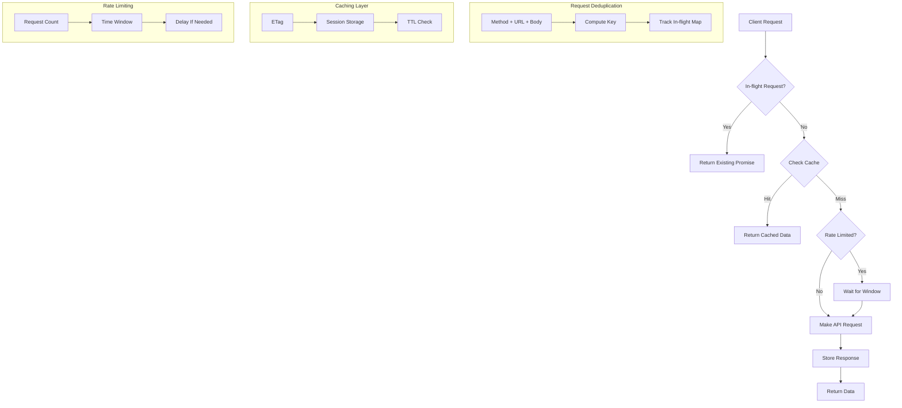
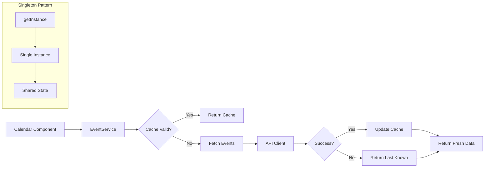

# 📅 Calendar - Event Management System

<div align="center">


**A high-fidelity fullstack calendar clone with advanced task management, analytics, and Indian holidays support**

[Features](#-features) • [Installation](#-getting-started) • [Tech Stack](#-tech-stack) • [Documentation](#-documentation)

</div>

---

## 🌟 Features

### ✨ Core Calendar Features

- ✅ **Full Event Management**: Create, read, update, and delete events
- 📅 **Multiple Views**: Month, Week, and Day calendar views
- 🎯 **Smart Date Selection**: Click any date/time slot to create an event with pre-filled date
- 🎨 **Beautiful UI**: Interactive modals with smooth animations
- 🌈 **8 Event Colors**: Customize events with vibrant colors
- ⏰ **All-day Events**: Support for all-day and timed events
- 📝 **Rich Event Details**: Title, description, location, dates, and times
- 🔄 **Recurrence Support**: Event recurrence patterns (JSON stored)

### 🎉 Task Completion System (Unique Feature)

- ✅ **Completion Tracking**: Mark events as completed with timestamp
- 💧 **Water Fill Animation**: Beautiful animated progress indicator showing completion percentage per day
  - Realistic water physics with waves and shimmer effects
  - Floating bubbles animation
  - Special gradient for 100% completion
  - Percentage badge with glow effects
- 🎊 **Completion Celebrations**: Confetti and success notifications
- 📊 **Visual Feedback**: Completed tasks show with strikethrough, fade, and grayscale
- 🎯 **Completion Badge**: Shows `completed/total` with percentage on each day

### 👤 Account Profile & Analytics (Unique Feature)

- 📈 **Comprehensive Statistics**: Total events, completed events, completion rate
- 🔥 **Day Streak Tracking**: Track consecutive days with completed tasks
- 📅 **Weekly & Monthly Comparisons**: Compare this week/month vs previous periods
- 📊 **Completion by Day Chart**: Visual chart showing completion patterns by day of week
- 📋 **Recent Activity**: View last 10 events with completion status
- 🎯 **Progress Visualization**: Animated progress bars and charts
- 📉 **Trend Indicators**: Visual arrows showing improvement trends

### 🇮🇳 Indian Holidays Support

- 🗓️ **National Holidays**: Automatically marks Indian national holidays
- 🚫 **Non-Working Days**: Holidays are marked as closed/non-working days
- 🎊 **Holiday Badges**: Visual indicators for holidays with flag emoji
- 📅 **Comprehensive Holiday Coverage (2024-2026)**:
  - New Year Day (Jan 1)
  - Makar Sankranti (Jan 14)
  - Republic Day (Jan 26)
  - Vasant Panchami (Jan/Feb)
  - Maha Shivratri (Feb/Mar)
  - Holi (Mar)
  - Good Friday (Mar/Apr)
  - Ram Navami (Mar/Apr)
  - Eid-ul-Fitr (Based on lunar calendar)
  - Maharashtra Day (May 1)
  - Buddha Purnima (May)
  - Eid al-Adha (Based on lunar calendar)
  - Independence Day (Aug 15) 🇮🇳
  - Janmashtami (Aug/Sep)
  - Ganesh Chaturthi (Aug/Sep)
  - Gandhi Jayanti (Oct 2)
  - Dussehra (Sep/Oct)
  - Diwali (Oct/Nov)
  - Guru Nanak Jayanti (Nov)
  - Christmas (Dec 25)

### 🌟 Unique Features (Not in Google Calendar)

- 🌙 **Dark Mode**: Full dark theme support with system preference detection
- ⚡ **Quick Event Templates**: One-click templates for common events
  - Meeting (30 min)
  - Team Lunch (1 hour)
  - Personal Break (15 min)
  - Conference Call (1 hour)
- 🔍 **Event Search**: Real-time search through all events with highlighting
- 🎨 **Enhanced Animations**: Smooth transitions using Framer Motion
- 🍞 **Toast Notifications**: User-friendly notifications for all actions
- 🔗 **Dynamic URL Routing**: Date-based URLs (e.g., `/2/november/2025`)
- 🚫 **Past Date Protection**: Past dates disabled for new events (existing events remain clickable)

---

## 🏗️ Architecture

This project uses a **microservice architecture** with separate backend and frontend:

```
Google-calendar-clone/
├── backend/          # Express.js API server
│   ├── src/
│   │   ├── routes/   # API routes
│   │   └── lib/      # Utilities, validation, middleware
│   └── prisma/       # Database schema
├── frontend/         # Next.js frontend application
│   ├── app/          # Next.js app directory
│   ├── components/   # React components
│   ├── lib/          # Frontend utilities
│   │   └── holidays.ts # Indian holidays data
│   └── public/       # Static assets (logo, icons)
└── README.md
```

### Request Flow & Deduplication



### Event Service Flow



---

## 🛠️ Tech Stack

### Backend

- **Node.js** with **Express.js** - RESTful API server
- **Prisma ORM** with **SQLite** - Database and ORM
- **TypeScript** - Type safety
- **Zod** - Schema validation
- **CORS** - Cross-origin resource sharing

### Frontend

- **Next.js 14** - React framework with App Router
- **React 18** with **TypeScript** - UI library
- **Tailwind CSS** - Utility-first CSS framework
- **Framer Motion** - Animation library
- **date-fns** - Date manipulation utilities
- **react-toastify** - Toast notifications

---

### 🚀 Getting Started

### Prerequisites

- **Node.js 18+** and **npm**
- **Git**
- **PostgreSQL** (for production)
- **VS Code** (recommended editor)

### Installation

1. **Clone the repository**

   ```bash
   git clone <repository-url>
   cd GoogleCalender-clone
   ```

2. **Set up the Backend**

   ```bash
   cd backend
   npm install
   npx prisma generate
   npx prisma db push
   ```

3. **Set up the Frontend**

   ```bash
   cd ../frontend
   npm install
   ```

### Environment Variables

#### Backend (`backend/.env`)

```env
# Database
DATABASE_URL="file:./dev.db"

# Server
PORT=3001
NODE_ENV=development

# CORS
CORS_ORIGIN=*
```

#### Frontend (`frontend/.env`)

```env
# API Configuration
NEXT_PUBLIC_API_URL=http://localhost:3001

# Environment
NODE_ENV=development
```

### Running the Application

#### Development Mode

1. **Start the Backend Server**

   ```bash
   cd backend
   npm run dev
   ```
   Backend runs on `http://localhost:3001`

2. **Start the Frontend Server** (in a new terminal)

   ```bash
   cd frontend
   npm run dev
   ```
   Frontend runs on `http://localhost:3000`

#### Production Mode

1. **Build and start Backend**

   ```bash
   cd backend
   npm run build
   npm start
   ```

2. **Build and start Frontend**

   ```bash
   cd frontend
   npm run build
   npm start
   ```

---

## 📡 API Endpoints

### Events API

Base URL: `http://localhost:3001/api/events`

- **GET** `/api/events` - Get all events (with optional query parameters)
  - Query params: `startDate`, `endDate`, `limit`, `offset`, `sortBy`, `sortOrder`
- **POST** `/api/events` - Create a new event
- **GET** `/api/events/:id` - Get a specific event
- **PUT** `/api/events/:id` - Update an event
- **DELETE** `/api/events/:id` - Delete an event

### Request/Response Format

**Success Response:**

```json
{
  "success": true,
  "data": { /* event data */ },
  "message": "Event created successfully",
  "meta": { /* pagination metadata */ }
}
```

**Error Response:**

```json
{
  "success": false,
  "error": "Error message or array of validation errors"
}
```

---

## 📁 Project Structure

### Backend Structure

```
backend/
├── src/
│   ├── server.ts              # Express server setup
│   ├── routes/
│   │   └── events.ts           # Event API routes
│   └── lib/
│       ├── prisma.ts          # Prisma client instance
│       ├── validation/        # Zod validation schemas
│       │   ├── eventSchema.ts  # Event validation
│       │   └── validate.ts    # Validation utilities
│       ├── middleware/        # API middleware
│       │   └── apiMiddleware.ts # Rate limiting, validation
│       └── utils/              # Utility functions
│           └── eventUtils.ts   # Event helper functions
├── prisma/
│   └── schema.prisma          # Database schema
├── .env                       # Environment variables
└── package.json
```

### Frontend Structure

```
frontend/
├── app/
│   ├── layout.tsx             # Root layout with providers
│   ├── page.tsx              # Main calendar page with routing
│   ├── [day]/[month]/[year]/  # Dynamic date-based routing
│   │   └── page.tsx          # Date-specific calendar page
│   └── globals.css           # Global styles and Tailwind CSS
├── components/
│   ├── Calendar.tsx           # Main calendar orchestrator
│   ├── EventModal.tsx         # Event creation/edit modal
│   ├── Sidebar.tsx            # Sidebar with mini-calendar
│   ├── DarkModeToggle.tsx     # Dark mode toggle button
│   ├── QuickTemplates.tsx      # Quick event templates
│   ├── SearchBar.tsx          # Event search component
│   ├── AccountProfile.tsx     # Account analytics and stats
│   ├── Confetti.tsx           # Confetti animation component
│   └── views/                 # Calendar view components
│       ├── MonthView.tsx      # Monthly grid view
│       ├── WeekView.tsx       # Weekly timeline view
│       └── DayView.tsx        # Daily timeline view
├── lib/
│   ├── api/
│   │   └── client.ts          # API client with error handling
│   └── holidays.ts            # Indian holidays data
├── public/
│   └── icon.svg               # Application logo/icon
├── types/
│   └── event.ts                # TypeScript interfaces
├── .env                       # Environment variables
└── package.json
```

---

## 🎨 Key Features Explained

### 📅 Date Click to Create

- Click any date in month view to create an event with that date pre-filled
- Click any time slot in week/day view to create an event at that specific time
- Event modal opens automatically with selected date/time
- URL updates to reflect selected date (e.g., `/2/november/2025`)

### ✅ Task Completion System

- **Mark as Complete**: Click checkbox in event modal
- **Visual Feedback**: 
  - Completed tasks: strikethrough, 40% opacity, grayscale filter
  - Green checkmark (✓) indicator
  - Cursor changes to `not-allowed`
- **Water Fill Animation**: 
  - Day box shows animated water fill representing completion percentage
  - Multiple layers: base gradient, wave pattern, shimmer, floating bubbles
  - Special celebration styling for 100% completion
  - Percentage badge shows `completed/total` and percentage
- **Completion Tracking**: 
  - `completedAt` timestamp automatically set
  - Status persisted in database

### 🇮🇳 Indian Holidays

- **Automatic Detection**: Holidays are automatically detected and marked
- **Visual Indicators**: 
  - Red/orange gradient badge with Indian flag emoji
  - Holiday name displayed on the day
- **Non-Working Days**: Holidays are marked as closed (cannot create events)
- **Current Holidays**: Supports 2024, 2025, and 2026

### 📊 Account Profile & Analytics

- **Statistics Dashboard**:
  - Total events created (all-time)
  - Completed events count (with today's count)
  - Overall completion rate percentage
  - Day streak counter (🔥)
- **Weekly & Monthly Analytics**:
  - This week's completion vs last week
  - This month's completion vs last month
  - Trend indicators showing improvements
  - Animated progress bars
- **Completion by Day Chart**:
  - Visual bar chart showing completion patterns for each day of week
  - Color-coded: Green (100%), Blue (50%+), Yellow/Orange (<50%)
- **Recent Activity**: Last 10 events with completion status

### 🌙 Dark Mode

- Toggle between light and dark themes
- Persistent theme preference saved in localStorage
- Automatically detects system preference on first load
- Smooth transitions between themes
- All components fully support dark mode

### ⚡ Quick Templates

- Pre-configured templates:
  - **Meeting**: 30-minute meeting
  - **Team Lunch**: 1-hour lunch break
  - **Personal Break**: 15-minute break
  - **Conference Call**: 1-hour conference call
- One-click event creation with sensible defaults
- Instant toast notification on creation

### 🔍 Event Search

- Real-time search across event titles, descriptions, and locations
- Highlights matching text in search results
- Click to navigate directly to the event
- Keyboard navigation support

### 🚫 Past Date Protection

- Past dates visually disabled (reduced opacity, `cursor-not-allowed`)
- Cannot create new events on past dates
- Existing events on past dates remain clickable for viewing/editing
- Applies to month view, week view, day view, and sidebar mini-calendar

---

## 💾 Database Schema

### Event Model

```prisma
model Event {
  id          String   @id @default(cuid())
  title       String
  description String?
  startDate   DateTime
  endDate     DateTime
  allDay      Boolean  @default(false)
  color       String   @default("#1a73e8")
  location    String?
  recurrence  String?
  completed   Boolean  @default(false)
  completedAt DateTime?
  createdAt   DateTime @default(now())
  updatedAt   DateTime @updatedAt
}
```

### Account Model

```prisma
model Account {
  id              String   @id @default(cuid())
  name            String
  email           String   @unique
  eventsCreated   Int      @default(0)
  eventsCompleted Int      @default(0)
  totalEvents     Int      @default(0)
  lastActiveAt    DateTime?
  createdAt       DateTime @default(now())
  updatedAt       DateTime @updatedAt
}
```

---

## 🗄️ Database

The application uses **SQLite** with Prisma ORM. The database file is located at:

- `backend/prisma/dev.db`

To view/edit the database:

```bash
cd backend
npx prisma studio
```

---

## 🔧 Development

### Backend Development

- TypeScript compilation: `npm run build`
- Development with hot reload: `npm run dev`
- Database migrations: `npx prisma db push`
- Generate Prisma client: `npx prisma generate`

### Frontend Development

- Development server: `npm run dev`
- Production build: `npm run build`
- Linting: `npm run lint`

---

## 🎯 Unique Features Summary

This calendar includes several features **NOT** in Google Calendar:

1. **🎉 Task Completion System** - Mark tasks as complete with visual tracking
2. **💧 Water Fill Animation** - Beautiful animated progress indicators
3. **👤 Account Analytics** - Comprehensive productivity statistics
4. **🔥 Day Streak Tracking** - Gamification for motivation
5. **🇮🇳 Indian Holidays** - National holidays with visual indicators
6. **🌙 Dark Mode** - Full dark theme support
7. **⚡ Quick Templates** - One-click event creation
8. **🔍 Event Search** - Real-time search functionality
9. **🎊 Completion Celebrations** - Confetti and success notifications
10. **📊 Completion Charts** - Visual analytics by day of week
11. **🚫 Past Date Protection** - Prevent creating events in the past

---

## 📝 API Validation

All API endpoints include comprehensive validation:

- **Request Validation**: Zod schemas validate all incoming data
- **Rate Limiting**: Protection against excessive requests
- **Content-Type Validation**: Ensures proper JSON content
- **ID Validation**: Validates event IDs format
- **Date Range Validation**: Ensures end date is after start date
- **Error Handling**: Standardized error responses

---

## 🔒 Security Features

- Input sanitization for all string fields
- SQL injection protection via Prisma ORM
- CORS configuration for API access control
- Rate limiting to prevent abuse
- Content-Type validation

---

## 🐛 Troubleshooting

### Backend not starting

- Check if port 3001 is available (use `netstat -ano | findstr 3001` on Windows)
- Ensure Prisma client is generated: `npx prisma generate`
- Verify database exists: `npx prisma db push`
- Check Node.js version compatibility: `node --version`
- Verify all dependencies are installed: `npm install`
- Check for TypeScript compilation errors: `npm run build`

### Frontend not connecting to backend

- Verify `NEXT_PUBLIC_API_URL` in `.env` matches backend URL
- Check CORS settings in backend
- Ensure backend is running on port 3001

### Database issues

- Reset database: Delete `backend/prisma/dev.db` and run `npx prisma db push`
- Regenerate Prisma client: `npx prisma generate`

---

## 📄 License

This project is for educational purposes.

---

## 🙏 Acknowledgments

- Inspired by Google Calendar
- Built with modern web technologies
- Designed for learning and demonstration purposes
- Indian holidays data sourced from official government calendar

---

## 📧 Support

For issues or questions, please open an issue on the repository.

---

<div align="center">

**Made with ❤️ using Next.js, React, Express, and TypeScript**

🇮🇳 **Proudly supporting Indian National Holidays**

</div>

